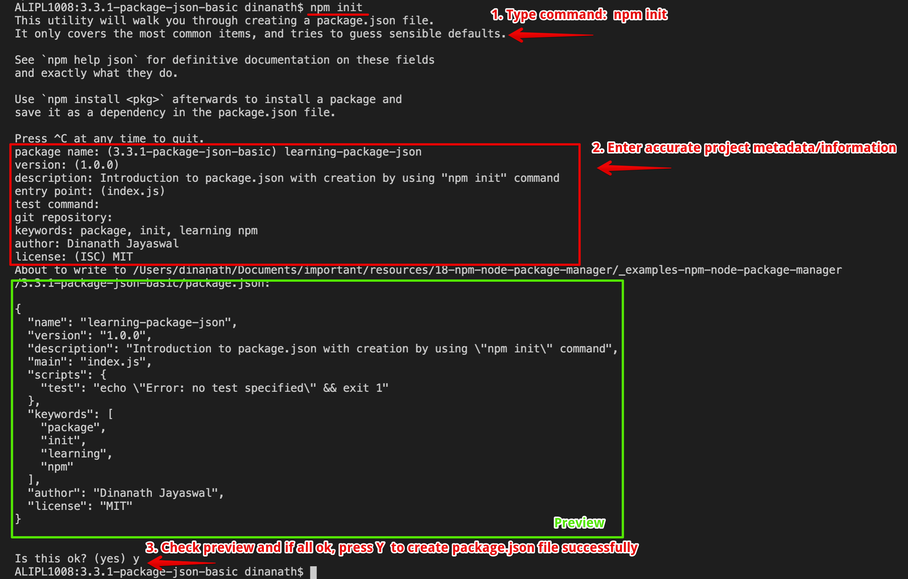
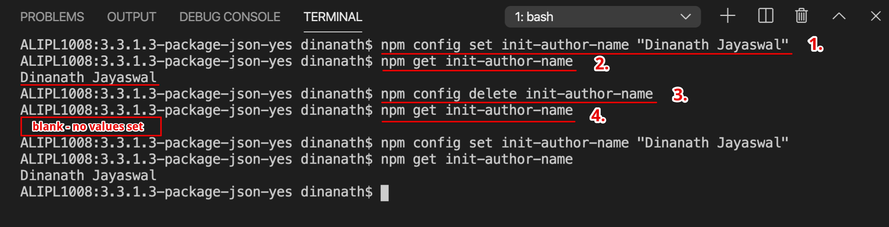

<p align="center">
 
</p>

<p align="center">
 
</p>

NPM - Node Package Manager beginners to advanced tutorial
=====================
NPM - Node Package Manager - Mastering the basics tutorial for all
=====================

NPM stands for `Node Package Manager`. NPM is a package manager for Node/JavaScript packages or modules. It is the largest ecosystem of code/packages in the open-source code community. It helps to automate installations and updations of dependent packages/modules/dependencies.

Welcome
---------------------

Hi All, I'm **`Dinanath Jayaswal, Senior UI/Web Developer and Adobe Certified Expert Professional`**, I wanna welcome you to `NPM - Node Package Manager` - Mastering the basics tutorial for all. 

About the Course/Tutorial
---------------------

This is a comprehensive & concise tutorial to learn/use the NPM - Node Package Manager. This complete & compact guide explains everything you want to know/learn about the NPM - Node Package Manager. This module will learn basics to advanced NPM commands which helps to manage application dependencies with package.json file.

NPM makes it easy for javascript developers to publish, share and reuse codes, and also makes it easy to update the codes with NPM Registry. 

This Node-NPM Tutorial will help/ease in understanding the basic building, needs and fundamentals of NPM and ultimately give a head start in Nodejs.

Who is this for? 
---------------------

This Course/Tutorial is ideal for:
- Candidates/Professionals who want to learn and master the basics of NPM commands
- JavaScript developers who want to know how to properly use NPM - Node Package Manager
- JavaScript/Node lovers want to acquire knowledge of NPM
- Professionals desire to become NPM Expert by publishing their own NPM modules/packages for other developers
- Developers who know JavaScript and wants to dive deeper with upcoming Node/NPM features
- Any Web designer/developer interested in getting a deep understanding of NPM - Node Package Manager
- Anyone with a passionate mindset to learn new/latest/upcoming tools/technologies/concepts/web standards to sharpen/improve their skills

Course/Tutorial achievement
---------------------
Course/Tutorial Goal
---------------------

After completing/attending/finishing this Course/Tutorial, participants should be able to: 
- Understand What-Why of Node, NPM, also how to use
- Get a strong understanding of various npm commands and be able to make use of npm for Node, Angular, React and other similar technologies
- Initialize and Setup new project/app using `npm init`
- Understand the purpose of `package.json` and `package-lock.json` file
- Work with project dependencies and development dependencies (manage, list, update, remove dependencies as per requirement)
- Discover the Semantic versioning system (Semver)
- Configure NPM scripts and execute them
- Publish, update own solutions/package/modules to the npm registry

Prerequisites for current course / What you need to know
---------------------

- Basic/Intermediate knowledge of HTML5 and CSS3
- Basics of JavaScript will be an added advantage
- How to use a text editor such as Notepad++, Sublime Text and/or IDE like Visual Studio Code 
- How to use Command Line Tool, Terminal, Command Prompt to type a basic commands

Topics included/covered
=====================

1. [Introduction to Node-Nodejs](#1-introduction-to-node-nodejs)
    - 1.1. [What is Node-Nodejs](#11-what-is-node-nodejs)
    - 1.2. [Why Node](#12-why-node)
    - 1.3. [What Node can do?](#13-what-node-can-do)
    - 1.4. [Installing Node/NPM](#14-installing-node)

2. [Introduction to NPM](#2-introduction-to-npm)
    - 2.1. [What is NPM](#21-what-is-npm)
    - 2.2. [Package Manager/Module Manager](#22-package-manager-module-manager) | [Package Management System](#22-package-management-system)
      - 2.2.1. [Package-Module](#221-package-module)
      - 2.2.2. [Package Management System](#222-package-management-system)
      - 2.2.3. [Dependencies](#223-dependencies)
    - 2.3. [NPM Role-functionality](#23-npm-role-functionality)
    - 2.4. [Advantages of NPM](#24-advantages-of-npm)

3. [Getting started with NPM](#3-getting-started-with-npm)
    - 3.1. [Installing NPM](#31-installing-npm)
    - 3.2. [NPM Help](#32-npm-help) | [Getting NPM Help](#32-getting-npm-help)
    - 3.3. [Package json init](#33-package-json-init)
      - 3.3.1. [package json](#331-package-json) 
      - 3.3.2. [package-lock json](#332-package-lock-json)
      - 3.3.3. [package json benefits](#333-package-json-benefits)
      - 3.3.4. [Basic-Common Project File Folder Structure-Architecture](#334-basic-common-project-file-folder-structure-architecture)
    - 3.4. [SemVer](#34-semver) | [Semantic Versioning](#34-semantic-versioning) | [Semantic Versioning System](#34-semantic-versioning-system)
    - 3.5. [package json Defaults](#35-package-json-defaults) | [package json Default values](#35-package-json-default-values) 

4. [Installation of the NPM packages](#4-installation-of-the-npm-packages) | [Dealing with NPM packages NPM Registry](#4-dealing-with-npm-packages-npm-registry)
    - 4.1. [Popular famous NPM Packages](#41-popular-famous-npm-packages)
    - 4.2. [More on NPM Packages](#42-more-on-npm-packages) | [Local and Global Packages](#42-local-and-global-packages)
    - 4.3. [Installing Local Packages](#43-installing-local-packages) | [Installing Node-NPM Package Locally](#43-installing-node-npm-package-locally)
    - 4.3.1. [Installing Specific Version of a Package](#431-installing-specific-version-of-a-package)
    - 4.4. [Uninstalling Local Packages](#44-uninstalling-local-packages)
    - 4.5. [Installing Global Packages](#45-installing-global-packages)
    - 4.6. [Uninstalling Global Packages](#46-uninstalling-global-packages)
    - 4.7. [Listing the Installed Packages](#47-listing-the-installed-packages)
    - 4.8. [Installing from package json](#48-installing-from-package-json) | [Using readymade package json](#48-using-readymade-package-json)
    - 4.9. [Updating Packages](#49-updating-packages)
      - 4.9.1. [NPM Outdated](#491-npm-outdated) 
      - 4.9.2. [Updating Local Packages](#492-updating-local-packages) 
      - 4.9.3. [Updating Global Packages](#493-updating-global-packages) 
      - 4.9.4. [Updating Saving Dependencies](#494-updating-saving-dependencies) 
      - 4.9.5. [Updating Latest Major release](#495-updating-latest-major-release) 
    - 4.10. [NPM Prune](#410-npm-prune) | [Remove Unused Extraneous Packages](#410-remove-unused-extraneous-packages)
    - 4.11. [Viewing Registry Info for a Package](#411-viewing-registry-info-for-a-package) | [Package Metadata Details Info](#411-package-metadata-details-info)

5. [Using a Extermal Package](#5-using-a-extermal-package) | [Using a Extermal Third Party Package](#5-using-a-extermal-third-party-package)

6. [Package Dependencies](#6-package-dependencies) | [Package Dependency Management](#6-package-dependency-management)
    - 6.1. [Application Dependencies](#61-application-dependencies)
    - 6.2. [Dev Dependencies](#62-dev-dependencies)

7. [NPM Packages and Source Control](#7-npm-packages-and-source-control)
    - 7.1. [Ignore node_modules folder](#71-ignore-node_modules-folder)

10. [NPM Resources](#10-npm-resources) 
    - 10.1. [Websites Reference Links](#101-websites-reference-links)
    - 10.2. [NPM command Shortcuts](#102-npm-command-shortcuts)
    - 10.3. [Commonly Widely used Node-NPM commands](#103-commonly-widely-used-node-npm-commands)

1 Introduction to Node-Nodejs
=====================

1.1. What is Node-Nodejs
---------------------

<p align="center">
 
</p>

- Node is a cross-platform, open-source runtime environment for executing JavaScript outside the browser i.e. at the server. We often use Node to build back-end services ie. API (Application Programming Interface)
- Node is ideally used to build Highly-scalable, data-intensive, real-time back-end services bases applications
- Nodejs is one of the most powerful and popular server technology. Google Chrome's V8 JavaScript engine is the core of Nodejs
- Node/Nodejs is open source server environment, it uses JavaScript on server
- Nodejs is a JavaScript runtime/code built on Google Chromes V8 javascript runtime engine. The V8 engine is written in C++ language which takes node(javascript) code and quickly compile/convert to machine code
- Nodejs can be defined/described with the following important terms:
  - Asynchronous
  - Non-blocking
  - Event-Based
  - Single thread / Single-threaded

1.2. Why Node
---------------------

- Great for prototyping and agile development
- Super-fast and highly scalable
- Non-blocking - Asynchronous nature (more tasks/code run at a time)
- JavaScript is a programming language used everywhere (Front-end + Back-end)
- Cleaner and more consistent codebase/source code
- The largest ecosystem of open-source libraries
- Great open-source community support

1.3. What Node can do
---------------------

Node/Nodejs can perform/do the following important things:
- Generate Dynamic page content
- Can Create, Open, Read, Write, Delete files on the server
- Collect Form Data
- Can perform CRUD (Create-Add, Read, Update-Edit/Modify, Delete) operation in Database

1.4. Installing Node
---------------------
1.4. Installing Node/NPM
---------------------
1.4. Install/Setup Node/NPM
---------------------

In this section, we will learn how to set up a local development environment by installing Node/NPM:

- NPM bundled and shift with Nodejs. In order to have NPM on our machine, we just need to download and install Node
- NPM is pre-built with Node/Nodejs so it gets installed automatically - no need to install it separately

1. To verify node/npm available/installed on machine, type command:
    - `node -v` / `node --version` 
    - `npm -v` / `npm --version`
2. If Node not available on machine than download and Install latest nodejs installer as per your OS, and continue installation (website: https://nodejs.org/en)
    - One can install LTS (Long Term Support) verion or current latest version anything is fine
<p>
 <figure>
 &nbsp;&nbsp;&nbsp; 
 <figcaption>&nbsp;&nbsp;&nbsp; Image - Nodejs website - https://nodejs.org/en</figcaption>
 </figure>
</p>

3. After installation, check installed version of node and npm or verify installation by using command: 
    - To get/check version of node, command: `node -v` / `node --version` 
    OR 
    - To get/check version of npm, command: `npm -v` / `npm --version`

2 Introduction to NPM
=====================

2.1. What is NPM
---------------------

<p align="center">
 
</p>

- NPM stands for `Node Package Manager `
- It is responsible for managing all the Node.js packages/dependencies and modules present in an application
- NPM comes `bundled with Node/Nodejs`, so it gets installed directly/automatically with Node
- NPM is the default package manager for Node, and it's fully written/coded/developed in JavaScript
- `NPM (Node Package Manager)` is a command-line tool and registry for Third-Party Library(s) which we can add to our Node/Nodejs application
- Node Package Manager is the largest ecosystem (software registry) in the open-source code community. It helps to automate installations and updations of dependent packages
- For any types of functionality, we need to incorporate/add-in application, most probably a free, open-source Node library/package/module available with NPM
- Now a days NPM is a very popular/well-known term among the Web Development community. NPM is a package manager for Node/JavaScript packages or modules
- Developed by `Isaac Z. Schlueter`, initially released in `Jan-2010`

2.2. Package Manager Module Manager
---------------------
2.2. Package Management System
---------------------

### **2.2.1. Package-Module**
---------------------
The package is nothing but just a `collection of code ready to use`, it is usually managed and maintained with a package management system.

Sometimes word Package is alternatively used in place of Module. Package/Module is nothing but a single or bunch of reusable code file(s) wrapped together with a special file named `Package.json`

- **What is a Package?**
  - A Packages contains all the files which are needed for a module(s)
- **What is a Module(s)?**
  - Module(s) are the JavaScript libraries that can be included in Node projects as per the requirement

### **2.2.2. Package Management System**
---------------------

- Software that automates installing and updating packages as and when required
- Package Management System Software deals with what version developer/user needs, and it also manages dependencies

### **2.2.3. Dependencies**
---------------------

- Code/program/Instructions that another set of Code/program depends on to function (Like We use particuler set of code in our app, it is a dependency - our app depends on it. It may be possible that current code depends on some other code and have some other dependencies)

2.3. NPM Role-functionality
---------------------

- It provides an online repository for Node/NodeJs Packages/modules/utilities which we can easily search at
  - (website: https://www.npmjs.com/) 
- It equips/provides a CLI (Command Line Interface) utility to install Node/NodeJs Packages
  - CLI helps/allows the developers to interact with their systems locally also perform version management and dependency management for Node/NodeJs Packages
- NPM allows/helps developers to publish their solution(s) code/package/module into NPM Registry so that other developers facing the same issue can re-use the code by installing the required NPM package/module
- NPM is a way to share code with other developers worldwide, also re-use the code of other developer and easily manage different version of the code base
- Helps to incorporate the pre-built packages into the project
- Assists in downloading various stand-alone tools which can be used any time/right away (adapting any packages as and when the need arises )
- With `npx` we can run and use packages without downloading it
- Developers can share their code with other worldwide NPM users/developers 
- It helps in restricting the code to the specific or particular group of developers (forming virtual team using orgs/organizations)
- Helps in managing and maintaining various versions of codes and their dependencies
- NPM automatically updates the application with the update in the codes

<p>
 <figure>
 &nbsp;&nbsp;&nbsp; 
 <figcaption>&nbsp;&nbsp;&nbsp; Image - Npmjs website - https://www.npmjs.com/ </figcaption>
 </figure>
</p>

2.4. Advantages of NPM
---------------------

- Completely free and open source
- Simpler than SOAP (Simple Object Access Protocol)
- Default package manager of Nodejs
- World's largest software registry (The largest ecosystem of open-source libraries) 
- Fully developed in JavaScript
- Manage local and global dependencies of project/application/tool
- An easy and fast CLI (Command Line Interface) utility to install packages/modules/solutions

3 Getting started with NPM
=====================

3.1. Installing NPM
---------------------
3.1. Install/Setup NPM
---------------------
3.1. Getting/Downloading/Installing/Setting up NPM
---------------------

In this section, we will learn how to set up a local development environment by installing NPM:

- NPM bundled and shift with Nodejs. In order to have NPM on our machine, we just need to download and install Node
- NPM is pre-built with Node/Nodejs so it gets installed automatically - no need to install it separately

1. To verify node/npm available/installed on machine, type command:
    - `node -v` / `node --version` 
    - `npm -v` / `npm --version`
2. If Node not available on machine than download and Install latest nodejs installer as per your OS, and continue installation (website: https://nodejs.org/en)
    - One can install LTS (Long Term Support) verion or current latest version anything is fine
<p>
 <figure>
 &nbsp;&nbsp;&nbsp; 
 <figcaption>&nbsp;&nbsp;&nbsp; Image - Nodejs website - https://nodejs.org/en</figcaption>
 </figure>
</p>

3. After installation, check installed version of node and npm or verify installation by using command: 
    - To get/check version of node, command: `node -v` / `node --version` 
    OR 
    - To get/check version of npm, command: `npm -v` / `npm --version`

4. To install specific npm version command: 
    - Syntax: `npm install -g npm@version_number`   (`-g` flag is to install globally)
    - Command: `npm install -g npm@x.x.x`,  `npm install -g npm@8.2.1`

5. If any permission error occurs:
    - MacOS
      - Run any node/npm commands as `sudo` or `administrator`, command: `sudo npm install -g` or `sudo npm i -g`

    - Windows
      - Open Command Prompt/Terminal Window with Administrative privileges, Right Click on Terminal (Windows Command Prompt) Icon/Programm -> Choose Run As Administrator

3.2. NPM Help
---------------------
3.2. Getting NPM Help
---------------------

- Getting/Using help with Node/NPM is pretty simple, generally `-h` or `-help` or `--help` flag is used to get/show help about npm or any other npm command
- Syntax: Get NPM help: `npm -h` OR `npm -help` OR `npm --help`
- Syntax: Get any NPM command help: `npm <command_name> -h` OR `npm <command_name> -help` OR `npm <command_name> --help`
- `npm -h` OR `npm -help` OR `npm --help` command shows typical usage of NPM and various sub-flag/options available to use
- Example: To get npm help: `npm -h` OR `npm -help` OR `npm --help`
- Example: To get help of install command: `npm install -h` OR `npm install -help` OR `npm install --help`

<p>
 <figure>
 &nbsp;&nbsp;&nbsp; 
 <figcaption>&nbsp;&nbsp;&nbsp; Image - 3.2.1 - Getting npm help with npm -h </figcaption>
 </figure>
</p>

<hr/>

<p>
 <figure>
 &nbsp;&nbsp;&nbsp; 
 <figcaption>&nbsp;&nbsp;&nbsp; Image - 3.2.2 - Getting npm help for specific command | npm install -h </figcaption>
 </figure>
</p>

3.3. Package json init
---------------------

### **3.3.1. package json**
---------------------

`Package.json` is an important file for any Node or similar applications, let learn and understand some facts about it:

- For any Node application, the `package.json` file is the heart or main file of the entire application
- `package.json` file is basically the entry point or `manifest file` that contains the generic `metadata`/information about Node application-project in the form of (application name, version, author, license, dependencies, etc.) of the project
- It is present in the `root directory` of any Node/Angular/React or similar application and/or `node_modules` folder, used to define/contains properties of a package (metadata specific to the project)
- If we want to create a public package/module or many peoples working on the same distributed project/package/module then its advisable to create a package.json file at the root of the project
- One can create package.json file with different ways like: 
  - manually 
  - through node/npm command: `npm init`,
  - with yarn command: `yarn init`
- To create package.json file use npm command: `npm init` and answer basics questions related to the application like application name, version, author, license details, project/application description, dependencies, etc.
  - command: `npm init` - initialize the project and create a package.json file
- command: `npm init -y` OR `npm init --yes` (the `-y` or `--yes` flag take default answers of questions and create a package.json file directly)
  - `-y` OR `--yes` flag skips all questions and creates package.json with default values

<p>
 <figure>
 &nbsp;&nbsp;&nbsp; 
 <figcaption>&nbsp;&nbsp;&nbsp; Image - 3.3.1.1 - Package.json with npm init </figcaption>
 </figure>
</p>

> **Syntax & Example**: `3.3.1.1-package-json-basic/package.json`

```json
{
  "name": "learning-package-json",
  "version": "1.0.0",
  "description": "Introduction to package.json with creation by using \"npm init\" command",
  "main": "index.js",
  "scripts": {
    "test": "echo \"Error: no test specified\" && exit 1"
  },
  "keywords": [
    "package",
    "init",
    "learning",
    "npm"
  ],
  "author": "Dinanath Jayaswal",
  "license": "MIT"
}
```

<p>
 <figure>
 &nbsp;&nbsp;&nbsp; 
 <figcaption>&nbsp;&nbsp;&nbsp; Image - 3.3.1.2 - Package.json </figcaption>
 </figure>
</p>

<hr/>

<p>
 <figure>
 &nbsp;&nbsp;&nbsp; 
 <figcaption>&nbsp;&nbsp;&nbsp; Image - 3.3.1.3 - Package.json with npm init -y </figcaption>
 </figure>
</p>

> **Syntax & Example**: `3.3.1.3-package-json-yes/package.json`

```json
{
  "name": "3.3.1.3-package-json-yes",
  "version": "1.0.0",
  "description": "",
  "main": "index.js",
  "scripts": {
    "test": "echo \"Error: no test specified\" && exit 1"
  },
  "keywords": [],
  "author": "",
  "license": "ISC"
}
```

<p>
 <figure>
 &nbsp;&nbsp;&nbsp; 
 <figcaption>&nbsp;&nbsp;&nbsp; Image - 3.3.1.4 - Package.json with -y flag </figcaption>
 </figure>
</p>

Each package or dependencies have proper/meaningful version - let us learn about `SemVer or Semantic Versioning` [SemVer](#34-semver) | [Semantic Versioning](#34-semantic-versioning) now!

### **3.3.2. package-lock json**
---------------------

- package-lock.json is automatically generated for any operations where npm modifies `node_modules` or `package.json`

### **3.3.3. package json benefits**
---------------------

Package.json files provide the following benefits:
- Holds various metadata relevant to the project
  - contains project-specific metadata/information (application name, version, author, license, dependencies, etc.)
- Manage dependencies of project/application
  - Any package and its version (popular npm packages are: nodemon, express, lodash, moment, etc.)
- Scripts section: (Helps to write initial build scripts for project/application)
  - Commands/Process/Steps to run initially/by default
  
### **3.3.4. Basic-Common Project File Folder Structure-Architecture**
---------------------

| **Files/Folders**                   | **Description**                           |
| ------------------------------------------|-------------------------------------------|
| `**Folders:** `                           |                                           |
| node_modules                              | The packages specified in `package.json` file are installed into this folder (`node_modules`) when we `run npm install` command. Also provides `npm packages/dependencies` to the entire workspace/projects (`node_modules` folder consists of all installed packages mentioned in package.json) |
| `**Files:** `                             |  |
| package.json                              | Contains the packages to build and run our angular application, consists of Node/NPM library/package/module dependencies for application development. Custom script can also be added in as per requirements <br/><br/> **It contains two sets of packages:** <br/>1. **dependencies**: The dependencies are essential for running the application, and <br/>2. **devDependencies**: The devDependencies are only required to develop the application <br/><br/>These packages mentioned in `package.json`  are installed into the `node_modules` folder by the `Node Package Manager (npm)`, when `npm install` command is executed.<br/><br/>`"scripts"` property contains the useful and important `npm commands` needed to run/serve project |
| package-lock.json                         | Provides version information for all packages installed into node_modules by the npm client  |

3.4. SemVer
---------------------
3.4. Semantic Versioning 
---------------------
3.4. Semantic Versioning System
---------------------

- Change is nature's thumb rule, so every tool/technology/framework/library developed have to room for improvement
- **Versioning**:
  - Specifying what version of a set of code this is
  - It helps others to track if a new version has come out/released
  - This allows to watch for a new feature or to watch for `breaking changes` if any
- **Semantic**:
  - The word `semantic` implies that something conveys meaning (meaningful)
  - Semantic versioning follows certain rules while determining the current version number
  - The core of Semantic versioning system/rule: `MAJOR.MINOR.PATCH 1.0.0`
- Many Software Development companies worldwide and software giant like Google decided and declared that their frameworks and tools version will be upgraded as per `Semantic Versioning System`
- **`SemVer or Semantic Versioning or Semantic Versioning System`** has 3 main components as = ` x.x.x i.e. Major.Minor.Fix Patch version/release, example: 0.0.1`
  - `Fix Patch` - can increase any time with bug fixes/patch release `|` Bug fixes, simple changes `|` Some bugs were fixed and code works fine. `1.0.1`

  - `Minor version` - increases with every feature release which does not break any functionalities `|` Adding/changing new/old feature which does not break existing functionality in application `|` Some new features added and code works fine `1.1.0`

  - `Major version` - Break in the functionalities, extraordinary feature achievements `|` Totally new/fresh features which extra ordinary breaking changes `|` Big changes & new functionalities added and code works fine `2.0.0` 

- SemVer or Semantic Versioning symbols:
  - `^ caret` sign = upgrade if change in Minor/Patch version like 1.x.x

  - `~ tilde/tilda` sign = upgrade if change in Patch version like 1.0.x

> **website**: semver.org | https://semver.org/

3.5. package json Defaults
---------------------
3.5. package json Default values
---------------------

- To set desired default values in package.json
  - command `npm config set init-author-name "Dinanath Jayaswal"`
  - OR `npm set init-license "MIT"`

- To get default values of package.json
  - command `npm config get init-author-name`
  - OR `npm get init-license`

- To unset any default values set in package.json
  - command `npm config delete init-author-name`
  - OR `npm delete init-license`

<p>
 <figure>
 &nbsp;&nbsp;&nbsp; 
 <figcaption>&nbsp;&nbsp;&nbsp; Image - 3.5.1 - Package.json set get default values </figcaption>
 </figure>
</p>

> **Syntax & Example**: `3.5-package-json-set-default-values/package.json`

```json
{
  "name": "3.5-package-json-set-default-values",
  "version": "1.0.0",
  "description": "",
  "main": "index.js",
  "scripts": {
    "test": "echo \"Error: no test specified\" && exit 1"
  },
  "keywords": [],
  "author": "Dinanath Jayaswal",
  "license": "ISC"
}
```

<p>
 <figure>
 &nbsp;&nbsp;&nbsp; 
 <figcaption>&nbsp;&nbsp;&nbsp; Image - 3.5.2 - Package.json with default values set </figcaption>
 </figure>
</p>

4 Installation of the NPM packages
=====================
4 Dealing with NPM packages NPM Registry
=====================

- NPM allows/helps developers to publish their solution(s) code/package/module into `NPM Registry` so that other developers facing the same issue can re-use the code by installing the required NPM package/module
- All packages live/exist in an online NPM registry
- One can just visit (website: https://www.npmjs.com/) and simply `search` for required solution/package/module

4.1. Popular famous NPM Packages
---------------------

- website: https://www.npmjs.com/
- Search for required packages and install accordingly

Here is the list of various commonly used, popular and famous npm packages available:

| **Package/Module** | **Description** | 
| --------------------------------|-------------------------------------------|
| `express ` | HTTP helpers web framework for node <br/> command to install: `npm install express` |
| `body-parser` | Body parsing middleware |
| `nodemon` | Utility to monitor any changes in source code and reload the application automatically (restart/reloads application/server if any changes done by the developer). |
| `babel-core` | Compile/Transpile ES6 code to ES5 code |
| `lodash` | Makes working with JavaScript easier |
| `react` | Helps to create ReactJs applications |
| `request` | Helps in making HTTP calls most easily/most quickly |
| `async` | Helps to work with async JavaScript applications |
| `moment` | Parse, validate, manipulate and display dates |
| `angular/cli` | Generating and serving an Angular project via a development server |

<p>
  <figure>
  &nbsp;&nbsp;&nbsp; 
    <figcaption>&nbsp;&nbsp;&nbsp; Image - 4.4.1 - Popular Famous NPM Packages: Moment </figcaption>
  </figure>
</p>

4.2. More on NPM Packages
---------------------
4.2. Local and Global Packages
---------------------

The package is nothing but just a `collection of code ready to use`, it is usually managed and maintained with a package management system.

Sometimes word Package is alternatively used in place of Module. Package/Module is nothing but a single or bunch of reusable code file(s) wrapped together with a special file named `Package.json`.

Packages are categorized under `two different categories` depending on their mode of installation done by developer:

1. Local Packages
2. Global Packages

### 1. Local Packages

- Local Packages are `installed within the current project/application directory` where one will be executing the `npm install` command and will be accessible by `only current project/application`
- If any package required or makes sense `only to a specific project/application` than it is advisable to install the package locally in the current project folder

> **Syntax**: `npm install <package_name>` OR `npm i <package_name>`

> **Example**: `npm install moment`

### 2. Global Packages

- Global Packages are installed at a single/central place (`path environment variables`) in your system and they can be used by `any of the projects present in your system`
- Some packages are commonly used in multiple angular/node projects/application in such scenarios its advisable to install those packages globally so that its available under `path environment variables`
- Globally installed dependencies are not part of/not residing in `package.json` and/or `node_modules`
- We can use the `-g` flag to install the package globally

> **Syntax**: `npm install <package_name> -g` OR `npm i <package_name> -g`

> **Example**: `npm install moment -g`

4.3. Installing Local Packages
---------------------
4.3. Installing Node-NPM Package Locally
---------------------

- If any package required or makes sense `only to a specific project/application` than it is advisable to install the package locally in the current project folder
- At npm official website: https://www.npmjs.com/ we can search for the specifically required package and have all help/detailed information of the package
- To install any third-party library or npm package in Node application use command: `npm install <package_name>` OR `npm i <package_name>` (it download and install packages also makes/add an entry in package.json file)
- All packages/modules and dependencies mentioned in `package.json` get installed under the folder `node_modules`

> **Syntax**: `npm install <package_name>` OR `npm i <package_name>`

> **Example**: `npm install moment`

<p>
  <figure>
  &nbsp;&nbsp;&nbsp; " title="Installing local package: npm install <package_name>" width="1000" border="2" />
    <figcaption>&nbsp;&nbsp;&nbsp; Image - 4.3.1.1 - Installing local package: npm install <package_name> </figcaption>
  </figure>
</p>

<p>
  <figure>
  &nbsp;&nbsp;&nbsp; " title="Installing local package: package.json <package_name>" width="1000" border="2" />
    <figcaption>&nbsp;&nbsp;&nbsp; Image - 4.3.1.2 - Installing local package: package.json <package_name> </figcaption>
  </figure>
</p>

> **Syntax & Example**: `4.3.1-Installing Local Packages-npm-i/package.json`

```json
{
  "name": "npm-local-package-installation",
  "version": "1.0.0",
  "description": "Learn to install npm packages locally",
  "main": "index.js",
  "scripts": {
    "test": "echo \"Error: no test specified\" && exit 1"
  },
  "keywords": [
    "npm",
    "node",
    "local",
    "package",
    "npm",
    "install"
  ],
  "author": "Dinanath Jayaswal",
  "license": "MIT",
  "dependencies": {
    "moment": "^2.24.0"
  }
}
```

<p>
  <figure>
  &nbsp;&nbsp;&nbsp; 
    <figcaption>&nbsp;&nbsp;&nbsp; Image - 4.3.1.3 - Installing local package: folder structure </figcaption>
  </figure>
</p>

<hr/>

- As per the recent NPM version, whatever npm package we install with command `npm i <package_name>` the `package.json by default take a record/an entry` of the same as dependencies (in old/past version we use to provide `--save` flag-like `npm i <package_name> --save`)
- To save the package/module in a package.json as a dependency for current project, we must have to use following command: 
> **Syntax**: `npm install <pakcage_name> --save` OR `npm i <pakcage_name> --save`

> **Example**: `npm install moment --save`

<hr/>

- Development or Developer dependency based package must be part of devDependency in package.json (packages needed for develpoment and are not required for production) 
> **Syntax**: `npm install <pakcage_name> --save-dev` OR `npm i <pakcage_name> --save-dev`

> **Example**: `npm install @angular/cli --save-dev`

<p>
  <figure>
  &nbsp;&nbsp;&nbsp;  --save-dev" title="Installing local package: npm install <package_name> --save-dev" width="1000" border="2" />
    <figcaption>&nbsp;&nbsp;&nbsp; Image - 4.3.1.4 - Installing local package: npm install --save-dev <package_name> </figcaption>
  </figure>
</p>

<p>
  <figure>
  &nbsp;&nbsp;&nbsp;  with dev dependency" title="Installing local package: package.json <package_name> with dev dependency" width="1000" border="2" />
    <figcaption>&nbsp;&nbsp;&nbsp; Image - 4.3.1.5 - Installing local package: package.json <package_name> with dev dependency </figcaption>
  </figure>
</p>

> **Syntax & Example**: `4.3.1-Installing Local Packages-npm-i/package.json`

```json
{
  "name": "npm-local-package-installation",
  "version": "1.0.0",
  "description": "Learn to install npm packages locally",
  "main": "index.js",
  "scripts": {
    "test": "echo \"Error: no test specified\" && exit 1"
  },
  "keywords": [
    "npm",
    "node",
    "local",
    "package",
    "npm",
    "install"
  ],
  "author": "Dinanath Jayaswal",
  "license": "MIT",
  "dependencies": {
    "moment": "^2.24.0"
  },
  "devDependencies": {
    "@angular/cli": "^8.3.23"
  }
}
```

<p>
  <figure>
  &nbsp;&nbsp;&nbsp; 
    <figcaption>&nbsp;&nbsp;&nbsp; Image - 4.3.1.6 - Installing local package: folder structure with multiple packages </figcaption>
  </figure>
</p>

4.3.1. Installing Specific Version of a Package
---------------------

Sometimes we need to upgrade or downgrade to the specific version of a particular package. To install/setup a specific version use following command:

> **Syntax**: `npm install <package_name>@version`

> **Example**: `npm install underscore@1.9.2`


4.4. Uninstalling Local Packages
---------------------

Sometimes we need to uninstall some unwanted and deprecated packages from current project/application with command `npm uninstall <package_name>`. As and when we uninstall some package, its entry gets deleted from `package.json` file and `node_module` folder.

> **Syntax**: `npm uninstall <package_name>` OR ` npm un <package_name>`

> **Example**: `npm uninstall moment`

- To remove the entry of deleted packages from package.json file (if required)

> **Syntax**: `npm uninstall <pakcage_name> --save` OR `npm un <package_name> --save`

> **Example**: `npm uninstall <pakcage_name> --save`

- Uninstall/delete dev dependencies if any: 

> **Syntax**: `npm uninstall <pakcage_name> --save-dev` OR `npm un<pakcage_name> --save-dev`

> **Example**: `npm uninstall @angular/cli --save-dev`

4.5. Installing Global Packages
---------------------

- Global Packages are installed at a single/central place (`path environment variables`) folder in your system and they can be used by `any of the projects present in your system`
- Some npm packages are commonly used in multiple angular/node projects/applications, in such scenario, it is advisable to install those packages globally so that its available under `path environment variables`
- Globally installed dependencies are not part of/not residing in `package.json` and/or `node_modules`
- We can use `-g` flag with `npm install` command to install a package globally

> **Syntax**: `npm install <package_name> -g` OR `npm i <package_name> -g`

> **Example**: `npm install moment -g`

- To get a list of global outdated packages command: `npm outdated -g`

4.6. Uninstalling Global Packages
---------------------

- To uninstall global packages we can use following command:

> **Syntax**: `npm uninstall <package_name> -g` OR `npm un <package_name> -g`

> **Example**: `npm uninstall moment -g` OR `npm un moment -g`

- NPM `remove` command is also used to uninstall global packages:

> **Syntax**: `npm remove <package_name> -g` OR `npm rm <package_name> -g`

> **Example**: `npm remove moment -g` OR `npm rm moment -g`

4.7. Listing the Installed Packages
---------------------

- To get the list of dependencies/packages installed in the application, one can have a manually look in `package.json` file or check-in `node_modules` folder but these processes are pretty time consuming, so its advisable to use `npm list` command
- `npm list` command displays the tree-like structure of packages locally installed

> `npm list`: To get list/tree of all installed dependencies (Tree of main as well as sub dependencies)

<p>
 <figure>
 &nbsp;&nbsp;&nbsp; 
 <figcaption>&nbsp;&nbsp;&nbsp; Image - 4.7.1.1 - NPM List </figcaption>
 </figure>
</p>

> `npm list --depth=0` OR `npm list --depth 0`: Get the list of main dependencies only (No sub dependencies)

<p>
 <figure>
 &nbsp;&nbsp;&nbsp; 
 <figcaption>&nbsp;&nbsp;&nbsp; Image - 4.7.1.2 - NPM List Depth 0 : npm list --depth=0 </figcaption>
 </figure>
</p>

> `npm list --depth=1` OR `npm list --depth 1` : Show package with only one ie. 1st level of dependency

<p>
 <figure>
 &nbsp;&nbsp;&nbsp; 
 <figcaption>&nbsp;&nbsp;&nbsp; Image - 4.7.1.3 - NPM List Depth 1 : npm list --depth=1 </figcaption>
 </figure>
</p>

- To get list of global packages:

> `npm list --global true --depth 0`: Show list of Global packages with main dependencies only (No sub dependencies)

<p>
 <figure>
 &nbsp;&nbsp;&nbsp; 
 <figcaption>&nbsp;&nbsp;&nbsp; Image - 4.7.1.4 - NPM List Global Depth 0 : npm list --global true --depth 0 </figcaption>
 </figure>
</p>

4.8. Installing from package json
---------------------
4.8. Using readymade package json
---------------------
4.8. Setup Project Development environment with existing package json
---------------------

- Many times other developers share their application metadata and dependencies information in the form of `package.json` which helps to set up the development/project environment
- It is advisable to share only `package.json` file with other developers/team members or external world (No need to share `node_modules` folder)
- One can simply run an npm command: `npm install` to download/install all required dependencies locally as mentioned in `package.json` file
- `npm install` - command is one of the most widely used and common commands of node/npm
- It first creates `node_modules` folder and installs all the packages with listed dependencies mentioned in package.json

4.9. Updating Packages
---------------------

It is important to update packages from time to time basis so that we make the best use of new features/utilities that are available/introduced with every release.

In the actual development world, there might be a newer version of the package/dependency with which we are working and installed in the project.

### **4.9.1. NPM Outdated**
---------------------

- To find out the outdated packages/dependencies and to get the details of current and latest versions in tabular form

> **Syntax**: `npm outdated`

> **Example**: `npm outdated`

<p>
 <figure>
 &nbsp;&nbsp;&nbsp; 
 <figcaption>&nbsp;&nbsp;&nbsp; Image - 4.9.1 - NPM outdated list </figcaption>
 </figure>
</p>

### **4.9.2. Updating Local Packages**
---------------------

- To update all packages
> **Syntax**: `npm update`

> **Example**: `npm update`

- To update specific package
> **Syntax**: `npm update <package_name>`

> **Example**: `npm update moment`

### **4.9.3. Updating Global Packages**
---------------------

- To update all global packages
> **Syntax**: `npm update -g`

> **Example**: `npm update -g`
 

- To update specific global package
> **Syntax**: `npm update <package_name> -g`

> **Example**: `npm update @angular/cli -g`

- To update npm itself
> **Example**: `npm install npm@latest -g`

### **4.9.4. Updating Saving Dependencies**
---------------------

- To update and save all dependencies in package.json:
> **Syntax**: `npm update <package_name> --save`

> **Example**: `npm update moment --save`

- To update and save all dev dependencies in package.json:
> **Syntax**: `npm update --dev --save-dev`

> **Example**: `npm update --dev --save-dev`

### **4.9.5. Updating Latest Major release**
---------------------

- **Note:** The command `npm update`, updates packages to the only Minor/Patch release (Usually, we use `^ caret` sign which denotes minor/patch release only)
- To check and install the latest Major release we can need to use/install another npm package named `npm-check-updates` OR `ncu`
  - To install `npm-check-updates`use command: `npm install npm-check-updates -g`
- Once `ncu` installed, run command: `npm-check-updates` OR `ncu` to get the list of all latest updated version of packages
- Run command: `ncu -u` to upgrade package.json file with latest versions of packages
- Finally run the command: `npm install` to install all updated packages from package.json

4.10. NPM Prune
---------------------
4.10. Remove Unused Extraneous Packages
---------------------

The `npm list` command shows up a list of `unused, unwanted, extraneous packages` installed just for R&D or testing purposes and also installed by mistake. 

- To remove/delete/uninstall and clean such extraneous/unwanted packages we must need to use command: 

> **Syntax**: `npm prune` OR `npm prune <package_name>`

> **Example**: `npm prune`

This command removes such extraneous packages. If a package name is provided, then only packages matching one of the supplied names are removed.

4.11. Viewing Registry Info for a Package
---------------------
4.11. Package Metadata Details Info
---------------------

To learn some npm package or get more detailed information about a package, one is supposed to visit/head over to (website: https://www.npmjs.com/), search for the package, read technical metadata information in the form of (use case, versions, dependencies, etc.) 

The quickest, fastest and advisable way to get metadata details is to use npm commands as given below:

- Get all info/metadata or package.json file of specific/particular `<package_name>` with all dependencies

> **Syntax**: `npm view <package_name>`

> **Example**: `npm view underscore`

- To get the list of only dependencies for `<package_name>`

> **Syntax**: `npm view <package_name> dependencies`

> **Example**: `npm view @angular/cli dependencies`

- To get the released version of a package

> **Syntax**: `npm view <package_name> version`

> **Example**: `npm view underscore version`

- To get the all released versions of a package

> **Syntax**: `npm view <package_name> versions`

> **Example**: `npm view underscore versions`

<p>
  <figure>
  &nbsp;&nbsp;&nbsp; 
    <figcaption>&nbsp;&nbsp;&nbsp; Image - 4.11.1 - Package Metadata Details Info </figcaption>
  </figure>
</p>

<p>
  <figure>
  &nbsp;&nbsp;&nbsp; 
    <figcaption>&nbsp;&nbsp;&nbsp; Image - 4.11.2 - Package Metadata Dependencies Details Info </figcaption>
  </figure>
</p>

<p>
  <figure>
  &nbsp;&nbsp;&nbsp; 
    <figcaption>&nbsp;&nbsp;&nbsp; Image - 4.11.3 - Package Metadata Versions Details Info </figcaption>
  </figure>
</p>

5 Using a Extermal Package
=====================
5 Using a Extermal Third Party Package
=====================

1. Visit the website: https://www.npmjs.com
    - At npm official website: https://www.npmjs.com/ we can search for the specifically required package and have all help/detailed information of the package
2. Search for any popular npm package/library like `underscore` website: `https://underscorejs.org/` (its a utility for widely used for JavaScript functions, JavaScript's functional programming helper library.)
3. Install `underscore` by using npm command: `npm i underscore`, (now a days as per the latest node/npm versions, we no longer need to specify `--save` flag (an entry in package.json and `node_modules` done automatically/by default))
4. Create a new entry point file at the root of the package named `index.js`
    - Include/load underscore package/module: var _ = require('underscore');
    - First `package_name ie. underscore ` is searched in node core module than locally as files/folders and/or then in 'node_modules' folder
5. Check exact usability and use-cases of 'underscore' at website/help and use accordingly `underscore functions`
6. Check the files output by using node command: `node index.js`

> **Syntax & Example**: `5-using-external-third-party-package/package.json`

```json
{
  "name": "using-external-thir-party-package",
  "version": "1.0.0",
  "description": "Learn using-external-thir-party-package",
  "main": "index.js",
  "scripts": {
    "test": "echo \"Error: no test specified\" && exit 1"
  },
  "keywords": [
    "using-external-thir-party-package"
  ],
  "author": "Dinanath Jayaswal",
  "license": "MIT",
  "dependencies": {
    "underscore": "^1.9.2"
  }
}
```

> **Syntax & Example**: `5-using-external-third-party-package/index.js`

```js
// include/load underscore library
var _ = require('underscore');

// use underscore library
var isContains = _.contains(['hi', 'hello', 'hey', 'hola'], 'hello');
console.log('It contains hello:', isContains);
```
<p>
  <figure>
  &nbsp;&nbsp;&nbsp; 
    <figcaption>&nbsp;&nbsp;&nbsp; Image - 5.1 - Using a Extermal Third Party Package: Folder Structure </figcaption>
 </figure>
</p>

<p>
  <figure>
  &nbsp;&nbsp;&nbsp; 
    <figcaption>&nbsp;&nbsp;&nbsp; Image - 5.2 - Using a Extermal Third Party Package: Node Output </figcaption>
 </figure>
</p>

6 Package Dependencies
=====================

6 Package Dependency Management
=====================

Code/program/Instructions that another set of Code/program depends on to function (Like We use particuler set of code in our app, it is a dependency - our app depends on it. It may be possible that current code depends on some other code and have some other dependencies).

**There are two types of dependencies:**
1. Application/project dependencies
2. Dev dependencies

### **6.1. Application Dependencies**
---------------------

The dependencies are essential for running the application, basic common packages need every-time.

- The command `npm i <package_name>` will create one entry in `package.json` file and all required dependencies get installed under `node_modules` folder
  - Command: `npm install <package_name>`
- In the past/previous npm version, all dependencies use to install inside `folder->folder->folder` etc., but now as per latest node/npm - all dependencies are getting installed `at the root node_modules` folder to avoid deeply nested long path, characters limitations in file/folder naming convention

### **6.2. Dev Dependencies**
---------------------
Global dependencies: `npm install <package_name> -g`, it is installed in common program files folder

- Development dependencies like unit testing tools/packages, static analysis based packages, code bundling tools are not supposed to go to the production environment where we deploy the applications
- Use/Supply`--save-dev` flag to save provided package under dev dependencies (`devDependencies`) section of package.json file
  - `npm install <package_name> --save-dev`
> **Note:** All dependencies are getting installed under node_modules folder but segregated only in package.json file as `dependencies & devDependencies`. 

Global dependencies: `npm install <package_name> -g`, it is installed in common program files folder `path environment variables`

7 NPM Packages and Source Control
=====================

- It is advisable not to Share as well as check-in `node_modules` folder in git or any other Version Control System/Revision Control/SCM/SVC/SVN tools

```
- SCM - Software Configuration Management
    - SCM - Source Control Management Tool
- VCS - Version Control System
- SVC - Software Version Control
- SVN - Subversion (Software Version)
```

### **7.1. Ignore node_modules folder** 
### **How to ignore/exclude node_modules folder with git**
---------------------

- Create a `.gitignore` file in the local git repository folder
- List down all the files/folder which we want to ignore while check-in/check-out code 

> `.gitignore`
```
node_modules/
```

10 NPM Resources
=====================  

### **10.1. Websites Reference Links** 
---------------------

> **Reference:** - https://nodejs.org

> **Reference:** - https://www.npmjs.com/

### **10.2. NPM command Shortcuts** 
---------------------

| **Node-NPM command**                      | **Description**                           |
| ------------------------------------------|-------------------------------------------|
| npm init `-y`                             | Skips questions and creates package.json with default values)         |
| npm `i` <package_name>                    | Install                                   |
| npm i <package_name> `-S`                 | `Save` package as Dependency in package.json|
| npm i <package_name> `-D`                 | Save package as `devDependency` in package.json |
| `-g`                                      | Global                                    |
| npm `-v`                                  | Version                                   |

> **Reference:** - https://docs.npmjs.com/misc/config

### **10.3. Commonly Widely used Node-NPM commands** 
---------------------

### Table: Widely used Node-NPM commands

<div class="table-widely-used-commands">

| **Node-NPM command**                      | **Description**                           |
| ------------------------------------------|-------------------------------------------|
| `node -v`  OR `node --version`            | To get Node Version                       |
| `npm -v`  OR `npm --version`              | To NPM Node Version                       |
| `npm install -g @angular/cli`             | To install Angular CLI globally           |
| `npm -h` OR `npm -help` OR `npm --help`   | To get help on any node/npm command       |
| `npm install <package_name>` OR `npm i <package_name>`   | To Install Node-NPM Package  |


