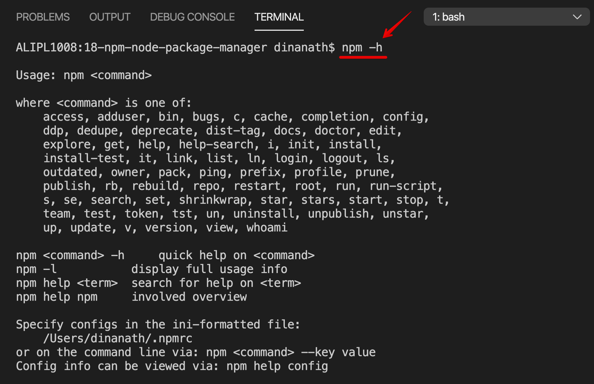

<p align="center">
 
</p>

<p align="center">
 
</p>

NPM - Node Package Manager beginners to advanced tutorial
=====================
NPM - Node Package Manager - Mastering the basics tutorial for all
=====================

NPM stands for `Node Package Manager`. NPM is a package manager for Node/JavaScript packages or modules. It is the largest ecosystem of code/packages in the open-source code community. It helps to automate installations and updations of dependent packages/modules/dependencies.

Welcome
---------------------

Hi All, I'm **`Dinanath Jayaswal, Senior UI/Web Developer and Adobe Certified Expert Professional`**, I wanna welcome you to `NPM - Node Package Manager` - Mastering the basics tutorial for all. 

About the Course/Tutorial
---------------------

This is a comprehensive & concise tutorial to learn/use the NPM - Node Package Manager. This complete & compact guide explains everything you want to know/learn about the NPM - Node Package Manager. This module will learn basics to advanced NPM commands which helps to manage application dependencies with package.json file.

NPM makes it easy for javascript developers to publish, share and reuse codes, and also makes it easy to update the codes with NPM Registry. 

This Node-NPM Tutorial will help/ease in understanding the basic building, needs and fundamentals of NPM and ultimately give a head start in Nodejs.

Who is this for? 
---------------------

This Course/Tutorial is ideal for:
- Candidates/Professionals who want to learn and master the basics of NPM commands
- JavaScript developers who want to know how to properly use NPM - Node Package Manager
- JavaScript/Node lovers want to acquire knowledge of NPM
- Professionals desire to become NPM Expert by publishing their own NPM modules/packages for other developers
- Developers who know JavaScript and wants to dive deeper with upcoming Node/NPM features
- Any Web designer/developer interested in getting a deep understanding of NPM - Node Package Manager
- Anyone with a passionate mindset to learn new/latest/upcoming tools/technologies/concepts/web standards to sharpen/improve their skills

Course/Tutorial achievement
---------------------
Course/Tutorial Goal
---------------------

After completing/attending/finishing this Course/Tutorial, participants should be able to: 
- Understand What-Why of Node, NPM, also how to use
- Get a strong understanding of various npm commands and be able to make use of npm for Node, Angular, React and other similar technologies
- Initialize and Setup new project/app using `npm init`
- Understand the purpose of `package.json` and `package-lock.json` file
- Work with project dependencies and development dependencies (manage, list, update, remove dependencies as per requirement)
- Discover the Semantic versioning system (Semver)
- Configure NPM scripts and execute them
- Publish, update own solutions/package/modules to the npm registry

Prerequisites for current course / What you need to know
---------------------

- Basic/Intermediate knowledge of HTML5 and CSS3
- Basics of JavaScript will be an added advantage
- How to use a text editor such as Notepad++, Sublime Text and/or IDE like Visual Studio Code 
- How to use Command Line Tool, Terminal, Command Prompt to type a basic commands

Topics included/covered
=====================

1. [Introduction to Node-Nodejs](#1-introduction-to-node-nodejs)
    - 1.1. [What is Node-Nodejs](#11-what-is-node-nodejs)
    - 1.2. [Why Node](#12-why-node)
    - 1.3. [What Node can do?](#13-what-node-can-do)
    - 1.4. [Installing Node/NPM](#14-installing-node)

2. [Introduction to NPM](#2-introduction-to-npm)
    - 2.1. [What is NPM](#21-what-is-npm)
    - 2.2. [Package Manager/Module Manager](#22-package-manager-module-manager) | [Package Management System](#22-package-management-system)
      - 2.2.1. [Package-Module](#221-package-module)
      - 2.2.2. [Package Management System](#222-package-management-system)
      - 2.2.3. [Dependencies](#223-dependencies)
    - 2.3. [NPM Role-functionality](#23-npm-role-functionality)
    - 2.4. [Advantages of NPM](#24-advantages-of-npm)

3. [Getting started with NPM](#3-getting-started-with-npm)
    - 3.1. [Installing NPM](#31-installing-npm)
    - 3.2. [NPM Help](#32-npm-help) | [Getting NPM Help](#32-getting-npm-help)
    - 3.3. [Package json init](#33-package-json-init)
      - 3.3.1. [package json](#331-package-json) 
      - 3.3.2. [package-lock json](#332-package-lock-json)
      - 3.3.3. [package json benefits](#333-package-json-benefits)
      - 3.3.4. [Basic-Common Project File Folder Structure-Architecture](#334-basic-common-project-file-folder-structure-architecture)

1 Introduction to Node-Nodejs
=====================

1.1. What is Node-Nodejs
---------------------

<p align="center">
 
</p>

- Node is a cross-platform, open-source runtime environment for executing JavaScript outside the browser i.e. at the server. We often use Node to build back-end services ie. API (Application Programming Interface)
- Node is ideally used to build Highly-scalable, data-intensive, real-time back-end services bases applications
- Nodejs is one of the most powerful and popular server technology. Google Chrome's V8 JavaScript engine is the core of Nodejs
- Node/Nodejs is open source server environment, it uses JavaScript on server
- Nodejs is a JavaScript runtime/code built on Google Chromes V8 javascript runtime engine. The V8 engine is written in C++ language which takes node(javascript) code and quickly compile/convert to machine code
- Nodejs can be defined/described with the following important terms:
  - Asynchronous
  - Non-blocking
  - Event-Based
  - Single thread / Single-threaded

1.2. Why Node
---------------------

- Great for prototyping and agile development
- Super-fast and highly scalable
- Non-blocking - Asynchronous nature (more tasks/code run at a time)
- JavaScript is a programming language used everywhere (Front-end + Back-end)
- Cleaner and more consistent codebase/source code
- The largest ecosystem of open-source libraries
- Great open-source community support

1.3. What Node can do
---------------------

Node/Nodejs can perform/do the following important things:
- Generate Dynamic page content
- Can Create, Open, Read, Write, Delete files on the server
- Collect Form Data
- Can perform CRUD (Create-Add, Read, Update-Edit/Modify, Delete) operation in Database

1.4. Installing Node
---------------------
1.4. Installing Node/NPM
---------------------
1.4. Install/Setup Node/NPM
---------------------

In this section, we will learn how to set up a local development environment by installing Node/NPM:

- NPM bundled and shift with Nodejs. In order to have NPM on our machine, we just need to download and install Node
- NPM is pre-built with Node/Nodejs so it gets installed automatically - no need to install it separately

1. To verify node/npm available/installed on machine, type command:
    - `node -v` / `node --version` 
    - `npm -v` / `npm --version`
2. If Node not available on machine than download and Install latest nodejs installer as per your OS, and continue installation (website: https://nodejs.org/en)
    - One can install LTS (Long Term Support) verion or current latest version anything is fine
<p>
 <figure>
 &nbsp;&nbsp;&nbsp; 
 <figcaption>&nbsp;&nbsp;&nbsp; Image - Nodejs website - https://nodejs.org/en</figcaption>
 </figure>
</p>

3. After installation, check installed version of node and npm or verify installation by using command: 
    - To get/check version of node, command: `node -v` / `node --version` 
    OR 
    - To get/check version of npm, command: `npm -v` / `npm --version`

2 Introduction to NPM
=====================

2.1. What is NPM
---------------------

<p align="center">
 
</p>

- NPM stands for `Node Package Manager `
- It is responsible for managing all the Node.js packages/dependencies and modules present in an application
- NPM comes `bundled with Node/Nodejs`, so it gets installed directly/automatically with Node
- NPM is the default package manager for Node, and it's fully written/coded/developed in JavaScript
- `NPM (Node Package Manager)` is a command-line tool and registry for Third-Party Library(s) which we can add to our Node/Nodejs application
- Node Package Manager is the largest ecosystem (software registry) in the open-source code community. It helps to automate installations and updations of dependent packages
- For any types of functionality, we need to incorporate/add-in application, most probably a free, open-source Node library/package/module available with NPM
- Now a days NPM is a very popular/well-known term among the Web Development community. NPM is a package manager for Node/JavaScript packages or modules
- Developed by `Isaac Z. Schlueter`, initially released in `Jan-2010`

2.2. Package Manager Module Manager
---------------------
2.2. Package Management System
---------------------

### **2.2.1. Package-Module**
---------------------
The package is nothing but just a `collection of code ready to use`, it is usually managed and maintained with a package management system.

Sometimes word Package is alternatively used in place of Module. Package/Module is nothing but a single or bunch of reusable code file(s) wrapped together with a special file named `Package.json`

- **What is a Package?**
  - A Packages contains all the files which are needed for a module(s)
- **What is a Module(s)?**
  - Module(s) are the JavaScript libraries that can be included in Node projects as per the requirement

### **2.2.2. Package Management System**
---------------------

- Software that automates installing and updating packages as and when required
- Package Management System Software deals with what version developer/user needs, and it also manages dependencies

### **2.2.3. Dependencies**
---------------------

- Code/program/Instructions that another set of Code/program depends on to function (Like We use particuler set of code in our app, it is a dependency - our app depends on it. It may be possible that current code depends on some other code and have some other dependencies)

2.3. NPM Role-functionality
---------------------

- It provides an online repository for Node/NodeJs Packages/modules/utilities which we can easily search at
  - (website: https://www.npmjs.com/) 
- It equips/provides a CLI (Command Line Interface) utility to install Node/NodeJs Packages
  - CLI helps/allows the developers to interact with their systems locally also perform version management and dependency management for Node/NodeJs Packages
- NPM allows/helps developers to publish their solution(s) code/package/module into NPM Registry so that other developers facing the same issue can re-use the code by installing the required NPM package/module
- NPM is a way to share code with other developers worldwide, also re-use the code of other developer and easily manage different version of the code base
- Helps to incorporate the pre-built packages into the project
- Assists in downloading various stand-alone tools which can be used any time/right away (adapting any packages as and when the need arises )
- With `npx` we can run and use packages without downloading it
- Developers can share their code with other worldwide NPM users/developers 
- It helps in restricting the code to the specific or particular group of developers (forming virtual team using orgs/organizations)
- Helps in managing and maintaining various versions of codes and their dependencies
- NPM automatically updates the application with the update in the codes

<p>
 <figure>
 &nbsp;&nbsp;&nbsp; 
 <figcaption>&nbsp;&nbsp;&nbsp; Image - Npmjs website - https://www.npmjs.com/ </figcaption>
 </figure>
</p>

2.4. Advantages of NPM
---------------------

- Completely free and open source
- Simpler than SOAP (Simple Object Access Protocol)
- Default package manager of Nodejs
- World's largest software registry (The largest ecosystem of open-source libraries) 
- Fully developed in JavaScript
- Manage local and global dependencies of project/application/tool
- An easy and fast CLI (Command Line Interface) utility to install packages/modules/solutions

3 Getting started with NPM
=====================

3.1. Installing NPM
---------------------
3.1. Install/Setup NPM
---------------------
3.1. Getting/Downloading/Installing/Setting up NPM
---------------------

In this section, we will learn how to set up a local development environment by installing NPM:

- NPM bundled and shift with Nodejs. In order to have NPM on our machine, we just need to download and install Node
- NPM is pre-built with Node/Nodejs so it gets installed automatically - no need to install it separately

1. To verify node/npm available/installed on machine, type command:
    - `node -v` / `node --version` 
    - `npm -v` / `npm --version`
2. If Node not available on machine than download and Install latest nodejs installer as per your OS, and continue installation (website: https://nodejs.org/en)
    - One can install LTS (Long Term Support) verion or current latest version anything is fine
<p>
 <figure>
 &nbsp;&nbsp;&nbsp; 
 <figcaption>&nbsp;&nbsp;&nbsp; Image - Nodejs website - https://nodejs.org/en</figcaption>
 </figure>
</p>

3. After installation, check installed version of node and npm or verify installation by using command: 
    - To get/check version of node, command: `node -v` / `node --version` 
    OR 
    - To get/check version of npm, command: `npm -v` / `npm --version`

4. To install specific npm version command: 
    - Syntax: `npm install -g npm@version_number`   (`-g` flag is to install globally)
    - Command: `npm install -g npm@x.x.x`,  `npm install -g npm@8.2.1`

5. If any permission error occurs:
    - MacOS
      - Run any node/npm commands as `sudo` or `administrator`, command: `sudo npm install -g` or `sudo npm i -g`

    - Windows
      - Open Command Prompt/Terminal Window with Administrative privileges, Right Click on Terminal (Windows Command Prompt) Icon/Programm -> Choose Run As Administrator

3.2. NPM Help
---------------------
3.2. Getting NPM Help
---------------------

- Getting/Using help with Node/NPM is pretty simple, generally `-h` or `-help` or `--help` flag is used to get/show help about npm or any other npm command
- Syntax: Get NPM help: `npm -h` OR `npm -help` OR `npm --help`
- Syntax: Get any NPM command help: `npm <command_name> -h` OR `npm <command_name> -help` OR `npm <command_name> --help`
- `npm -h` OR `npm -help` OR `npm --help` command shows typical usage of NPM and various sub-flag/options available to use
- Example: To get npm help: `npm -h` OR `npm -help` OR `npm --help`
- Example: To get help of install command: `npm install -h` OR `npm install -help` OR `npm install --help`

<p>
 <figure>
 &nbsp;&nbsp;&nbsp; 
 <figcaption>&nbsp;&nbsp;&nbsp; Image - 3.2.1 - Getting npm help with npm -h </figcaption>
 </figure>
</p>

<hr/>

<p>
 <figure>
 &nbsp;&nbsp;&nbsp; 
 <figcaption>&nbsp;&nbsp;&nbsp; Image - 3.2.2 - Getting npm help for specific command | npm install -h </figcaption>
 </figure>
</p>

3.3. Package json init
---------------------

### **3.3.1. package json**
---------------------

`Package.json` is an important file for any Node or similar applications, let learn and understand some facts about it:

- For any Node application, the `package.json` file is the heart or main file of the entire application
- `package.json` file is basically the entry point or `manifest file` that contains the generic `metadata`/information about Node application-project in the form of (application name, version, author, license, dependencies, etc.) of the project
- It is present in the `root directory` of any Node/Angular/React or similar application and/or `node_modules` folder, used to define/contains properties of a package (metadata specific to the project)
- If we want to create a public package/module or many peoples working on the same distributed project/package/module then its advisable to create a package.json file at the root of the project
- One can create package.json file with different ways like: 
  - manually 
  - through node/npm command: `npm init`,
  - with yarn command: `yarn init`
- To create package.json file use npm command: `npm init` and answer basics questions related to the application like application name, version, author, license details, project/application description, dependencies, etc.
  - command: `npm init` - initialize the project and create a package.json file
- command: `npm init -y` OR `npm init --yes` (the `-y` or `--yes` flag take default answers of questions and create a package.json file directly)
  - `-y` OR `--yes` flag skips all questions and creates package.json with default values

<p>
 <figure>
 &nbsp;&nbsp;&nbsp; 
 <figcaption>&nbsp;&nbsp;&nbsp; Image - 3.3.1.1 - Package.json with npm init </figcaption>
 </figure>
</p>

> **Syntax & Example**: `3.3.1.1-package-json-basic/package.json`

```json
{
  "name": "learning-package-json",
  "version": "1.0.0",
  "description": "Introduction to package.json with creation by using \"npm init\" command",
  "main": "index.js",
  "scripts": {
    "test": "echo \"Error: no test specified\" && exit 1"
  },
  "keywords": [
    "package",
    "init",
    "learning",
    "npm"
  ],
  "author": "Dinanath Jayaswal",
  "license": "MIT"
}
```

<p>
 <figure>
 &nbsp;&nbsp;&nbsp; 
 <figcaption>&nbsp;&nbsp;&nbsp; Image - 3.3.1.2 - Package.json </figcaption>
 </figure>
</p>

<hr/>

<p>
 <figure>
 &nbsp;&nbsp;&nbsp; 
 <figcaption>&nbsp;&nbsp;&nbsp; Image - 3.3.1.3 - Package.json with npm init -y </figcaption>
 </figure>
</p>

> **Syntax & Example**: `3.3.1.3-package-json-yes/package.json`

```json
{
  "name": "3.3.1.3-package-json-yes",
  "version": "1.0.0",
  "description": "",
  "main": "index.js",
  "scripts": {
    "test": "echo \"Error: no test specified\" && exit 1"
  },
  "keywords": [],
  "author": "",
  "license": "ISC"
}
```

<p>
 <figure>
 &nbsp;&nbsp;&nbsp; 
 <figcaption>&nbsp;&nbsp;&nbsp; Image - 3.3.1.4 - Package.json with -y flag </figcaption>
 </figure>
</p>

Each package or dependencies have proper/meaningful version - let us learn about `SemVer or Semantic Versioning` [SemVer](#34-semver) | [Semantic Versioning](#34-semantic-versioning) now!

### **3.3.2. package-lock json**
---------------------

- package-lock.json is automatically generated for any operations where npm modifies `node_modules` or `package.json`

### **3.3.3. package json benefits**
---------------------

Package.json files provide the following benefits:
- Holds various metadata relevant to the project
  - contains project-specific metadata/information (application name, version, author, license, dependencies, etc.)
- Manage dependencies of project/application
  - Any package and its version (popular npm packages are: nodemon, express, lodash, moment, etc.)
- Scripts section: (Helps to write initial build scripts for project/application)
  - Commands/Process/Steps to run initially/by default
  
### **3.3.4. Basic-Common Project File Folder Structure-Architecture**
---------------------

| **Files/Folders**                   | **Description**                           |
| ------------------------------------------|-------------------------------------------|
| `**Folders:** `                           |                                           |
| node_modules                              | The packages specified in `package.json` file are installed into this folder (`node_modules`) when we `run npm install` command. Also provides `npm packages/dependencies` to the entire workspace/projects (`node_modules` folder consists of all installed packages mentioned in package.json) |
| `**Files:** `                             |  |
| package.json                              | Contains the packages to build and run our angular application, consists of Node/NPM library/package/module dependencies for application development. Custom script can also be added in as per requirements <br/><br/> **It contains two sets of packages:** <br/>1. **dependencies**: The dependencies are essential for running the application, and <br/>2. **devDependencies**: The devDependencies are only required to develop the application <br/><br/>These packages mentioned in `package.json`  are installed into the `node_modules` folder by the `Node Package Manager (npm)`, when `npm install` command is executed.<br/><br/>`"scripts"` property contains the useful and important `npm commands` needed to run/serve project |
| package-lock.json                         | Provides version information for all packages installed into node_modules by the npm client  |
